# mcp-gateway — a hardened MCP server framework for exposing internal tools to LLM clients

[](https://github.com/darrshangovender/mcp-gateway/actions/workflows/tests.yml)
[](LICENSE)
[](https://python.org)
[](https://modelcontextprotocol.io)

> Wrap the tools you want Claude Desktop, an IDE, or an agent to call in the controls a company needs before it lets an AI touch its systems: **tenant isolation, per-tool auth and guardrails, rate limiting, audit logging, telemetry.** MCP over JSON-RPC 2.0, implemented here rather than imported, over stdio and HTTP/SSE.

**Why this exists.** An MCP server is an RPC surface into your company. The moment a model can call `get_customer`, everything behind that function is reachable by whoever holds the client — and by whatever the model was talked into. The reference servers are demos: they have no authentication, no notion of which tenant a caller belongs to, no limit on how often or how much a tool is called, no record of what happened, and they return whatever the tool returned, PII included. This is the production wrapper around those tools. The protocol is implemented in `mcp_gateway/protocol.py` so every message is a pydantic model you can read, and the whole thing runs and tests offline.

**The RPC-surface sibling of [guardrail](https://github.com/darrshangovender/guardrail)**, which validates LLM inputs and outputs in general, and [sql-guardrails](https://github.com/darrshangovender/sql-guardrails), which makes LLM-generated SQL safe to execute. This one guards the boundary where a model calls *your* code.

---

## Quick start

```bash
pip install -e ".[dev]"                 # pydantic + starlette; redis/otel are optional extras
python examples/crm_server.py demo      # two tenants, four tools, every control tripped once
python examples/client_demo.py          # a stdio client driving the server end to end
```

```python
import os

from pydantic import BaseModel
from mcp_gateway import APIKeyAuth, Gateway, ToolPolicy, tool, tenant_filter

class SearchIn(BaseModel):
    query: str

class SearchOut(BaseModel):
    rows: list[dict]

@tool("search_customers", input_model=SearchIn, output_model=SearchOut,
      scopes=("crm:read",), rate_tier="standard",
      policy=ToolPolicy(max_payload_bytes=2048, allowed_args=frozenset({"query"})))
def search_customers(args: SearchIn, ctx) -> SearchOut:
    tf = tenant_filter()                                   # raises if no tenant is bound
    rows = db.execute(f"SELECT * FROM customers WHERE {tf.sql} AND name LIKE ?",
                      (*tf.params, f"%{args.query}%")).fetchall()
    return SearchOut(rows=[dict(r) for r in rows])

auth = APIKeyAuth(salt=os.environ["MCP_GATEWAY_KEY_SALT"])
auth.add_key(os.environ["ACME_KEY"], tenant_id="acme", scopes=["tools:list", "tools:call", "crm:read"])

gateway = Gateway(tools=[search_customers], auth=auth)
gateway.serve_stdio()        # or: app = gateway.asgi()  ->  uvicorn module:app
```

Point Claude Desktop at the script with `MCP_GATEWAY_API_KEY` in its `env`, or run `uvicorn` and send JSON-RPC to `POST /mcp` with `Authorization: Bearer <key>`. `GET /mcp/events` is a per-tenant SSE stream of call outcomes. Bodies over 1 MiB are refused with HTTP 413 before parsing (`gateway.asgi(max_body_bytes=...)` to change it).

## How it works

```mermaid
flowchart LR
    R[JSON-RPC request] --> A[auth: key → Principal]
    A --> S[scope check]
    S --> L[rate limit per tenant × tool]
    L --> G[guardrails: size · allow-list · deny_if]
    G --> T[bind TenantContext]
    T --> X[tool]
    X --> O[tenant ownership check]
    O --> P[PII scrub]
    P --> U[audit + span + SSE event]
    U --> Y[JSON-RPC response]
```



1. The transport (stdio or HTTP) hands the dispatcher a raw message and the API key it found. It never interprets the message.
2. The key resolves to a `Principal(tenant_id, scopes, rate_tier)`. Keys are stored as salted SHA-256 and compared in constant time.
3. `tools:call` plus the tool's own scopes are required; a missing scope is `-32002`.
4. A token bucket per `(tenant, tool, tier)` decides; exhaustion is `-32003` with `retry_after`.
5. The tool's `ToolPolicy` checks payload size, argument allow-list and `deny_if`; any failure is `-32001`.
6. The tenant is bound in a contextvar, so concurrent calls cannot see each other's tenant, and the tool runs with validated arguments.
7. The result is validated against the output model, walked for rows tagged with a foreign `tenant_id` (`-32004` if any; the audit log records which tenant's rows leaked, the client is told only that the call was blocked), then scrubbed of emails, phone numbers and checksum-valid SA ID numbers. `resources/read` and `prompts/get` output goes through the same scrub.
8. Every outcome — allowed, denied, errored, including a malformed `tools/call` — is appended to the audit log with a hash of the arguments, never the arguments. A tool's exception text is scrubbed before it is recorded.

## The controls

| Control | Module | What it enforces | On failure |
|---|---|---|---|
| API-key auth | `auth.py` | Hashed keys, constant-time compare, scopes, rate tier, revocation | `-32002` |
| Tenant isolation | `tenancy.py` | `tenant_filter()` for data access; post-call check for foreign rows | `-32004` |
| Guardrails | `guardrails.py` | Payload cap, argument allow-list, `deny_if` predicate, PII scrub on output | `-32001` |
| Rate limiting | `ratelimit.py` | Token bucket per tenant × tool with named tiers; Redis or memory | `-32003` |
| Audit | `audit.py` | Append-only JSONL: who, tool, args hash, outcome, latency, reason | never skipped |
| Telemetry | `telemetry.py` | One span per call; OpenTelemetry if installed, no-op otherwise | — |
| Protocol | `protocol.py` | pydantic models for every message; `-32700/-32600/-32601/-32602` | per JSON-RPC |

## Design decisions

| Decision | Why |
|---|---|
| **Own protocol layer, not the official SDK** | Every message is a pydantic model in one file you can read, and the suite runs with no network and no SDK version drift. |
| **Tool exceptions are results, not protocol errors** | Per the MCP spec a failing tool returns `isError: true`; the class name goes to the client, the message goes to the audit log only. |
| **Two layers of tenancy** | `tenant_filter()` is what tools should use; the post-call walk catches the tool that forgot. Defence in depth for the failure that leaks the most. |
| **Hash the arguments in the audit log** | Arguments are where the PII lives. A hash still proves *what* was called and lets you correlate repeats. |
| **Rate limiter degrades to memory** | A limiter that takes the gateway down with Redis is worse than one that briefly limits per process. `degraded` is exposed on `/healthz`. |
| **Checksums before scrubbing SA IDs** | A 13-digit invoice reference is not an ID number. Luhn plus a valid date keeps the scrubber from redacting business data. |

## Limitations

- **API keys only.** No OAuth, no JWT, no per-user identity behind a key. A key is a tenant plus scopes; if you need user attribution, put it in the key id.
- **No streaming tool results.** A tool returns one value; long-running tools should return a handle.
- **Protocol version pinned** to `2025-03-26` and only the core methods are implemented: `initialize`, `ping`, `tools/*`, `resources/list|read`, `prompts/list|get`. No sampling, roots, subscriptions or `listChanged` notifications.
- **The SSE stream is one-way.** It carries the `endpoint` event and per-tenant call outcomes; requests still go over `POST /mcp`. Full Streamable HTTP resumability is not implemented.
- **The PII scrubber is regex plus checksums**, tuned for emails, South African phone formats and SA ID numbers. It will miss other identifiers and is not a substitute for not returning the column.
- **In-memory audit and rate limits are per process.** Use `JSONLAuditLog` and `RedisRateLimiter` for anything with more than one replica.
- **Rate limits are per tenant, so unauthenticated traffic is not limited.** Auth fails before the limiter runs; put the HTTP transport behind a reverse proxy with per-IP limiting if it is reachable from the internet. `/healthz` is unauthenticated and lists tool names.
- **Unexpected exceptions are logged, not raised.** Anything that is not a `GatewayError` becomes a bare `-32603` for the client and a traceback on the `mcp_gateway` logger; configure `logging` or you will not see it.

## Project layout

```
mcp-gateway/
├── mcp_gateway/
│   ├── protocol.py       # JSON-RPC 2.0 + MCP models, error codes, Dispatcher
│   ├── auth.py           # APIKeyAuth · Principal · require_scope
│   ├── tenancy.py        # TenantContext · tenant_filter · assert_tenant_owned
│   ├── guardrails.py     # ToolPolicy · check_input · scrub_pii (Luhn SA ID)
│   ├── ratelimit.py      # Tier · TokenBucket · MemoryRateLimiter · RedisRateLimiter
│   ├── audit.py          # AuditRecord · JSONLAuditLog · hash_args
│   ├── registry.py       # @tool · @resource · @prompt · Registry
│   ├── telemetry.py      # get_tracer · OTelTracer · NoopTracer · RecordingTracer
│   ├── events.py         # per-tenant pub/sub feeding SSE
│   ├── server.py         # Gateway: the pipeline, serve_stdio(), asgi()
│   └── transport/        # stdio.py (NDJSON) · http.py (POST /mcp, GET /mcp/events)
├── examples/             # crm_server.py (SQLite CRM, two tenants) · client_demo.py
├── tests/                # 128 tests, all offline
├── Dockerfile · docker-compose.yml · .env.example
```

## Tests

```bash
pytest tests/ -q          # 128 tests, no network, no Redis, no OpenTelemetry needed
ruff check .
```

Protocol conformance (each method, malformed JSON, unknown method, bad params, batches), auth (missing/wrong key, insufficient scope, revocation), tenancy (cross-tenant read blocked, contextvar isolation under concurrent calls from two tenants, violation replies that name no other tenant), guardrails (oversized payload, allow-list, `deny_if`, PII scrub on tool, resource and prompt output), rate limiting (refill maths, tier separation, Redis fallback with a fake client), audit (every outcome logged including malformed calls, arguments hashed, exception text scrubbed), HTTP via `httpx.ASGITransport` (including the body cap) and the SSE stream, and stdio through real pipes under a cp1252 console. CI runs the suite on Python 3.11 and 3.12.

## Author

Darrshan Govender · [Agulhas Code](https://agulhascode.co.za) · Durban, South Africa
